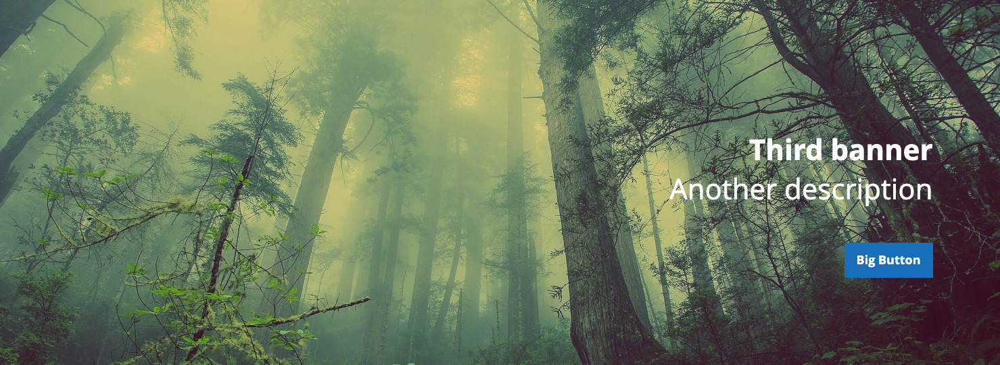

## Usage
**banner**

Banner element including styles for image, title, description and button.  
[ui-tabs position="top-left" active="0" theme="lite"]
[ui-tab title="Code"]
[raw]
```html
<div class="banner">                   
    <a href="#">
        <div class="banner__image">
            <picture>
                <source media="(min-width: 768px)" srcset="/image-desktop.jpg" />
                <source media="(max-width: 767px)" srcset="/image-mobile.jpg" />
                
            </picture>
        </div>
    </a>
                        
    <div class="banner__content align-center">
        <h2 class="banner__title">Some title</h2>

        <p class="banner__description">Banner description</p>
    
        <div class="banner__button">
            <a class="action button" href="#" target="target">Button</a>
        </div>
    </div>
</div>
```
[/raw]
[/ui-tab]
[ui-tab title="Preview"]

[/ui-tab]
[/ui-tabs]

## Classes
| Class | Purpose |
| --- | --- |
| .banner | Defines parent container |
| .banner__image | Positions banner image |
| .banner__content | Layout styles for banner content |
| .banner__title | Text properties of banner title  |
| .banner__description | Text properties of banner description |
| .banner__button | Layout styles for banner button |
| .align-[center/left/right] | Layout helper styles for banner content element |


## Variables
| Variable | Default Value |
| -------- | ------------- |
| @rw-banner__width | 1800px |
| @rw-banner__height | 600px |

