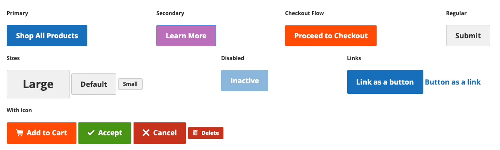

Custom styles for buttons.
>>> See [Magento UI library reference page](https://magento-devdocs.github.io/magento2-ui-library/buttons.html) for variables, mixins and default usage

### Usage
[ui-tabs position="top-left" active="0" theme="lite"]
[ui-tab title="Code"]
[raw]
```html 
<button class="action primary" type="button">
    <span>Shop All Products</span>
</button>

<button class="action secondary" type="button">
    <span>Learn More</span>
</button>

<button class="action flow" type="button">
    <span>Proceed to Checkout</span>
</button>

<button class="action" type="button">
    <span>Submit</span>
</button>

<button class="action large" type="button">
    <span>Large</span>
</button>

<button class="action" type="button">
    <span>Default</span>
</button>

<button class="action small" type="button">
    <span>Small</span>
</button>

<button class="action primary" type="button" disabled="">
    <span>Inactive</span>
</button>

<a href="#" class="action primary">Link as a button</a>
<button class="action link" type="button">
    <span>Button as a link</span>
</button>

<button class="action tocart" type="button">
    <i class="rw-icon-cart"></i>
    <span>Add to Cart</span>
</button>

<button class="action success" type="button">
    <i class="rw-icon-tick"></i>
    <span>Accept</span>
</button>

<button class="action error" type="button">
    <i class="rw-icon-close"></i>
    <span>Cancel</span>
</button>

<button class="action small error" type="button">
    <i class="rw-icon-trash"></i>
    <span>Delete</span>
</button>


```
[/raw]
[/ui-tab]
[ui-tab title="Preview"]

[/ui-tab]
[/ui-tabs]

### Classes
| Class | Purpose |
| --- | --- |
| .button / .action | Applies general Magento button styles |
| .primary | Applies primary styles |
| .secondary | Applies secodnary styles |
| .flow / .checkout / .tocart | Applies checkout flow button styles  |
| .success / .error | Appplies success/error button styles |
| .link | Resets default button styles and shows button as a link |
| .small / .small | Descreases or increases size of a button |


