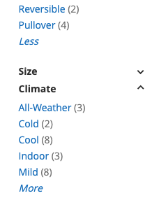

## Usage
**more toggle**

Creates a more/less toggle for expandable navigation lists. Requires [collapsibleFilters](/javascript/jquery/collapsible-filters) component.
[ui-tabs position="top-left" active="0" theme="lite"]
[ui-tab title="Code"]
[raw]
```html
<p class="more-toggle">
    <a href="#" title="">
        <span class="more">More</span>
        <span class="less">Less</span>
    </a>
</p>
```
[/raw]
[/ui-tab]
[ui-tab title="Preview"]

[/ui-tab]
[/ui-tabs]

## Classes
| Class | Purpose |
| --- | --- |
| .more-toggle | Applies toggle styles |
| .more | Toggles `more` link  |
| .less | Toggles `less` link |


## Variables
| Variable | Default Value |
| -------- | ------------- |
| @rw-collapsible__indicator | '\2303' |


## Mixins
| Mixin | Params | Purpose |
| ----- | ------ | ------- |
| .rwp-collapsible() |  | Uses `[data-collapsible='true']` child element to add collapsible indicator |
