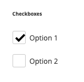

## Usage
**radio**

Styles radio form elements
[ui-tabs position="top-left" active="0" theme="lite"]
[ui-tab title="Code"]
[raw]
```html
<div class="field choice item">
    <input type="radio" class="radio" value="" id="radio1" name="radio">
    <label class="label" for="radio1">
        Option 1
    </label>
</div>
<div class="field choice item">
    <input type="radio" class="radio" value="" id="radio2" name="radio">
    <label class="label" for="radio2">
        Option 2
    </label>
</div>
```
[/raw]
[/ui-tab]
[ui-tab title="Preview"]

[/ui-tab]
[/ui-tabs]

**checkbox**

Styles checkbox form elements
[ui-tabs position="top-left" active="0" theme="lite"]
[ui-tab title="Code"]
[raw]
```html
<div class="field choice item">
    <input type="checkbox" id="checkbox1" class="checkbox">
    <label class="label" for="checkbox1">
        <span>Option 1</span>
    </label>
</div>
<div class="field choice item">
    <input type="checkbox" id="checkbox2" class="checkbox">
    <label class="label" for="checkbox2">
        <span>Option 2</span>
    </label>
</div>
```
[/raw]
[/ui-tab]
[ui-tab title="Preview"]

[/ui-tab]
[/ui-tabs]

**dropdown**

Styles select dropdown form elements
[ui-tabs position="top-left" active="0" theme="lite"]
[ui-tab title="Code"]
[raw]
```html
<div class="field" name="selectfield">
    <label class="label" for="options">
        <span>Options</span>
    </label>
    <div class="control">
        <select class="select" name="options" id="options" placeholder="" data-validate="{required:true}">
            <option value="">Please select an option</option>
            <option data-title="Option 1" value="1">Option 1</option>
            <option data-title="Option 2" value="2">Option 2</option>
            <option data-title="Option 3" value="3">Option 3</option>
        </select>
    </div>
</div>
```
[/raw]
[/ui-tab]
[ui-tab title="Preview"]

[/ui-tab]
[/ui-tabs]

## Classes
| Class | Purpose |
| --- | --- |
| .choice | Adds styles for radio/checkbox elements, relies on `type` attribute to differeniate between the two |
| .select | Adds styles for select dropdown |


## Variables
| Variable | Default Value |
| -------- | ------------- |
| @rw-form-choice__size | 24px |


## Mixins

| Mixin | Params | Purpose |
| ----- | ------ | ------- |
| .rwp-choice() | `@rw-choice__size, @rw-choice__color` | Defines layout styles for checkbox/radio elements |
| .rwp-dropdown() |  | Defines layout styles for select dropdown elements |
