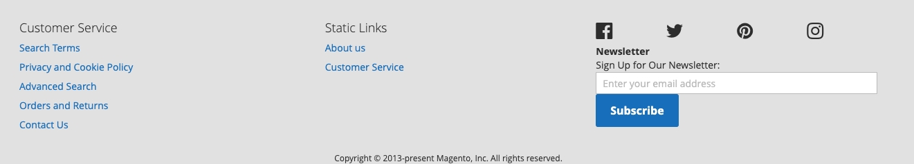

Footer element consists of the main content section with nested columns and additional footnote with copyright information. 

### Usage
[ui-tabs position="top-left" active="0" theme="lite"]
[ui-tab title="Code"]
[raw]
```html
<footer class="page-footer">
    <div class="footer content">    
        <div class="footer__column">...</div>
        <div class="footer__column">...</div>
        <div class="footer__column">...</div>
    </div>
    <div class="footer__bottom">...</div>
</footer>
```
[/raw]
[/ui-tab]
[ui-tab title="Preview"]

[/ui-tab]
[/ui-tabs]


### Layout
| Element name | Type | Classes assigned |
| --- | --- |
| footer-container | container | .page-footer |
| footer | container | footer content flex flex--wrap |
| footer.bottom | container | footer__bottom |
| footer.left / footer.middle / footer.right | block | `footer__column flex__item` |
| footer.social | container | footer-social flex flex--wrap |


### Classes
| Class | Purpose |
| --- | --- |
| .page-footer | Defines footer background color |
| .footer__column | Defines layout for colum on mobile |


### Variables
| Variable | Default Value |
| -------- | ------------- |
| @footer__background | @color-gray90 |