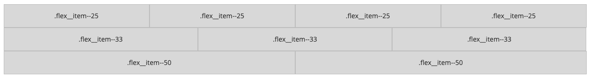
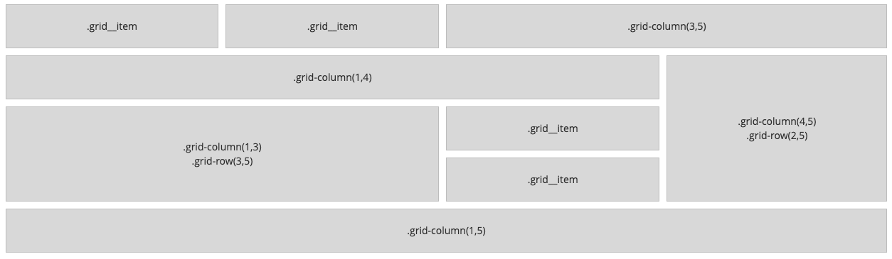

Aside from traditional column layout available in Magento Blank Prime offers two additional types of layouts for laying out content:
1. Flex layout
2. Grid layout

### Usage 

**Flex layout**
[ui-tabs position="top-left" active="0" theme="lite"]
[ui-tab title="Code"]
[raw]
```html
<div class="flex flex--wrap">
    <div class="flex__item flex__item--25">.flex__item--25</div>
    <div class="flex__item flex__item--25">.flex__item--25</div>
    <div class="flex__item flex__item--25">.flex__item--25</div>
    <div class="flex__item flex__item--25">.flex__item--25</div>
    <div class="flex__item flex__item--33">.flex__item--33</div>
    <div class="flex__item flex__item--33">.flex__item--33</div>
    <div class="flex__item flex__item--33">.flex__item--33</div>
    <div class="flex__item flex__item--50">.flex__item--50</div>
    <div class="flex__item flex__item--50">.flex__item--50</div>
</div>
```
[/raw]
[/ui-tab]
[ui-tab title="Preview"]

[/ui-tab]
[/ui-tabs]

**Grid layout**
[ui-tabs position="top-left" active="0" theme="lite"]
[ui-tab title="Code"]
[raw]
```html
<div class="grid grid--4">
    <div class="grid__item">.grid__item</div>
    <div class="grid__item">.grid__item</div>
    <div class="grid__item" style="grid-column: 3 / 5">.grid-column(3,5)</div>
    <div class="grid__item" style="grid-column: 1 / 4">.grid-column(1,4)</div>
    <div class="grid__item" style="grid-column: 4 / 5;grid-row: 2 / 5;">.grid-column(4,5)<br>.grid-row(2,5)</div>
    <div class="grid__item" style="grid-column: 1 / 3;grid-row: 3 / 5;">.grid-column(1,3)<br>.grid-row(3,5)</div>
    <div class="grid__item">.grid__item</div>
    <div class="grid__item">.grid__item</div>
    <div class="grid__item" style="grid-column: 1 / 5">.grid-column(1,5)</div>
</div>
```
[/raw]
[/ui-tab]
[ui-tab title="Preview"]

[/ui-tab]
[/ui-tabs]

### Classes
| Class | Purpose |
| --- | --- |
| column-wrapper | Specifies wrapper element for column layout |
| column--half / column--one-third / column--one-fourth | Specifies column widths  |
| column--last | Adds utility styles for the last column in a row |
| column--last | Adds utility styles for the last column in a row |
| flex | Displays element as flex |
| flex__item | Sets flex properties on children elements |
| `flex__item--50 / flex__item--33 / flex__item--25` | Sets widths of flex children elements |
| flex--wrap | Wraps flex elements |
| flex--row | Sets flex direction as row |
| grid | Displays element as grid | 
| grid--auto | Automatically calculates number of grid columns | 
| grid--2 / grid--3 / grid--4 / grid--6 | Manually sets number grid columns | 


### Variables
| Variable | Default Value |
| -------- | ------------- |
| @rw-layout__gutter | 15px |
| @rw-layout__grid-gap | 10px |
| @rw-layout__grid-width--min | 200px |


### Mixins
| Mixin | Params | Purpose |
| --- | --- | --- |
| .flex-set() |  | Sets `display` property as flex | 
| .flex-wrap() | @wrap: wrap / nowrap / wrap-reverse | Sets `flex-wrap` property |
| .flex-direction() | @direction: row / row-reverse / column / column-reverse  | Sets `flex-direcion` property |
| .flex-basis() | @width: {length} / auto | Sets `flex-basis` property |
| .flex-align() | @position: flex-start / flex-end / center / space-between / space-around / stretch  | Sets `align-content` property |
| .flex-basis() | @position: flex-start / flex-end / center / space-between / space-around / space-evenly  | Sets `justify-content` property |
| .grid-set() | @cols: {number}  | Sets up parent grid element with default 3 column layout | 
| .grid-auto() | @width: {width}; @method: auto-fit / auto-fill  | Sets up grid element with automatically calculated number of columns | 
| .grid-column() | @start: {number}; @end: {number}  | Specifies starting postion and span of a grid column | 
| .grid-row() | @start: {number}; @end: {number}  | Specifies starting postion and span of a grid row | 