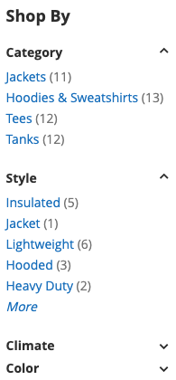

## Usage

Widget enables filter collapse functionality in layered navigation and limits number of visible filter options.
[ui-tabs position="top-left" active="0" theme="lite"]
[ui-tab title="Code"]
[raw]
```html
<div class="block-content filter-content" data-mage-init='{"collapsibleFilters": {"showMoreCount": 5}}'>
...
</div>
```
[/raw]
[/ui-tab]
[ui-tab title="Preview"]

[/ui-tab]
[/ui-tabs]


## Options
| Option | Default Value | Purpose |
| --- | --- | --- |
| filterCollapse | true | Enables toggleable filters in layered navigation |
| showMore | true | Enables More/Less button in option lists |
| showMoreCount | 6 | Sets number of visible filters options |
