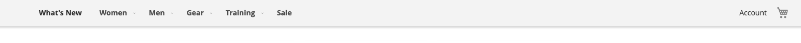

Widget enables sticky header functionality on desktops and mobile.

### Usage
[ui-tabs position="top-left" active="0" theme="lite"]
[ui-tab title="Code"]
[raw]
```html
<script type="text/x-magento-init">
    {
        "header.page-header": {
            "Magento_Theme/js/sticky-header": {
                "enableOnMobile": false,
                "stickyClass": "sticky-header",
                "wrapper": ".page-wrapper"
            }
        }
    }
</script>
```
[/raw]
[/ui-tab]
[ui-tab title="Preview"]

[/ui-tab]
[/ui-tabs]


### Options
| Option | Default Value | Purpose |
| --- | --- | --- |
| enableOnMobile | true | Enables sticky functionality on mobile |
| stickyClass | 'sticky-header' | Class to be applied to sticky element |
| wrapper | '.page-wrapper' | Parent container for element to stick to |