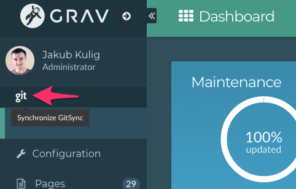

To setup the RWDocs project locally please follow these steps:
1. Download Grav skeleton [here](https://github.com/hibbitts-design/grav-skeleton-learn2-with-git-sync/archive/master.zip)
1. Extract it in your local folder
1. Go to the project folder
1. Remove the User folder: `rm -rf user`
1. Clone git repository: `git clone https://github.com/rocketweb-fed/rwdocs.git`
1. Rename *rwdocs* folder to *user*
1. Create a new admin account using:
	1. Grav CLI: `bin/plugin login new-user` or
	2. manually in _user/accounts/your_username.yaml_
	```
	password: 'password'
	email: 'youremail@mail.com'
	fullname: 'Johnny Appleseed'
	title: 'Site Administrator'
	access:
	  admin:
	    login: true
	    super: true
	```
	>>> After logging in to admin, your plaintext password will be removed and replaced by an encrypted one.
1. Setup your vhosts 
1. Log in to admin by going to _http://yourlocaladdress.com/admin_
1. Sync your repo with GitHub to make sure everything is working correctly. You can do that by clicking on a **git** link in the sidebar.  
	
	Once synced you should get a notification message in the top right corner saying:  
	> GitSync has successfully synchronized with the repository.
1. Create a new file `setup.php` in project root with the following contents:
    ```php
    <?php
    /**
     * Multisite setup for sub-directories or path based
     * URLs for subsites.
     *
     * DO NOT EDIT UNLESS YOU KNOW WHAT YOU ARE DOING!
     */

    use Grav\Common\Filesystem\Folder;

    // Get relative path from Grav root.
    $path = isset($_SERVER['PATH_INFO'])
       ? $_SERVER['PATH_INFO']
       : Folder::getRelativePath($_SERVER['REQUEST_URI'], ROOT_DIR);

    // Extract name of subsite from path
    $name = Folder::shift($path);
    $folder = "sites/{$name}";
    $prefix = "/{$name}";

    if (!$name || !is_dir(ROOT_DIR . "user/{$folder}")) {
        return [];
    }

    // Prefix all pages with the name of the subsite
    $container['pages']->base($prefix);

    return [
        'environment' => $name,
        'streams' => [
            'schemes' => [
                'user' => [
                   'type' => 'ReadOnlyStream',
                   'prefixes' => [
                       '' => ["user/{$folder}"],
                   ]
                ]
            ]
        ]
    ];
    ```
1. You're all set!