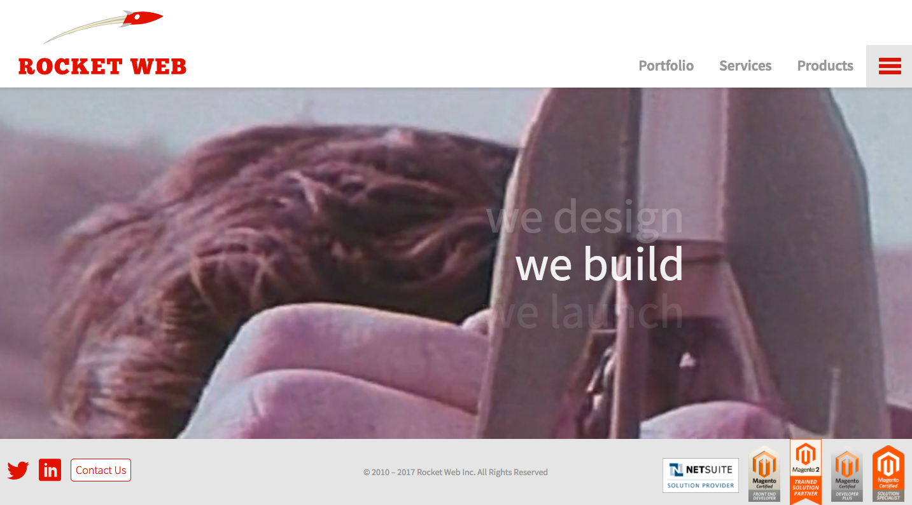

This shortcode wraps content (image, text, whatever) with a HTML/CSS Browser frame.
[raw]
```
[ui-browser address="http://rocketweb.com"]

[/ui-browser]
```
[/raw]

This code will display:
[ui-browser address="http://rocketweb.com"]

[/ui-browser]

[raw]
The `[ui-browser]` shortcode has some optional parameters:

* `address` - URL to display in the fake address bar of the browser
[/raw]